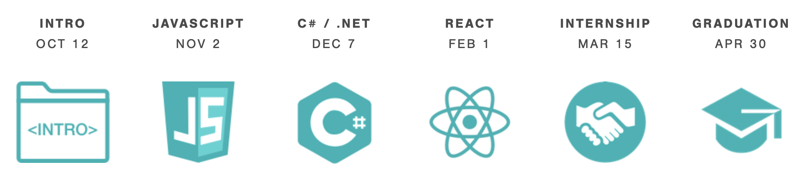

# _Welcome to the Pizza Parlor_

### By _**Tyler Sinks**_

### _This Project's Reason for Being and Description_
_This project functions as an exploratory work. Exploring what? This week Tyler explores big ideas in the JavaScript realm including the prototype chain, objects, and writing methods on the prototype chain._
* Created November 6, 2020
* Last major revision November 6, 2020
* Hopes to flex some just-covered JavaScript topics including writing methods to the prototype chain and objects
* These are topics explored during the fourth week of Epicodus's October 2020 cohort.
* the Epicodus program includes the following modules *(with start dates):*

* initially created in response to a project prompt to be designed and coded completely solo and within a nine hour window on **"6 November, 2020"**

## Setup/Installation Requirements

**Software that this project requires:**
1. a web browser
2. a plain text editor, such as `Basic Text Editor` available for Windows devices, or developer-go-to text editors such as Sublime Text, Atom, VIM, or Visual Studio Code
3. a command line (or "Terminal.app" on a Mac) program for entering git prompts as they are offered/suggested to be used verbatim from this README.md
4. No additional code libraries or dependencies need to be installed locally for you to experience this project in all its splendor.
    4a. Perhaps one should make sure that git is installed on one's machine, so as to be able to follow the git prompts for the command line interface below

**Most straightforward way to just see the rendered page:**
* [click this link](https://sinkstyt.github.io/pizza-parlor/index.html) to load the site as it is currently hosted by GitHub Pages
    * _Should this link fail you in any way, you could alternatively copy and paste the full address below into a web browser's address bar:_
    #### https://sinkstyt.github.io/pizza-parlor/index.html ####

## To Install the Whole Thing Locally

**Let's Call This: "To Take the `git` Route"**
1. Launch your terminal application (Terminal.app comes installed as default in the Mac OS since... I'm not sure when.)
2. Navigate to (or even first _create_) the directory to which you would like to copy the project's files to your machine. _AN EXAMPLE:_
    2a. `$  pwd`
    * > `{Users}\{YOUR_USER_NAME}\`
    2b. `$  mkdir thisPersonsPortfolioPage`
    2c. `$  cd thisPersonsPortfolioPage`
    * > `{Users}\{YOUR_USER_NAME}\thisPersonsPortfolioPage`
3. Now that you are in the destination directory, pull the files down to your machine from this README's GitHub repository. A suggested series of command line prompts follows by which one might do this:
    3a. `$~  pwd`
    * > `{Users}\{YOUR_USER_NAME}\thisPersonsPortfolioPage`
    3b. `$~  git clone {the_URL_of_my_GitHub_repository_pasted_from_your_clipboard}`[^bignote]
        _Something like this will then be printed to your console:_
        > Cloning into 'live-share'...
        > remote: Enumerating objects: 72, done.
        > remote: Counting objects: 100% (72/72), done.
        > remote: Compressing objects: 100% (58/58), done.
        > remote: Total 6989 (delta 24), reused 39 (delta 14), pack-reused 6917
        > Receiving objects: 100% (6989/6989), 51.25 MiB | 9.65 MiB/s, done.
        > Resolving deltas: 100% (4274/4274), done.
4. Now you've got somebody's project in that local directory. Happy perusing!
5. **A perusal suggestion** Use that command line, now that you're in the root folder for this project anyway, to launch your editor of choice (example, Visual Studio Code):
    `code .`
    > this should launch a new window in VS Code open to the root folder of the directory. Some unique system or user profile settings may bring an error message at this point. For help on this, _Stick with it! We're almost there!_ please check out the documentation appropriate to this error/your text editor of choice's command prompts.

## Known Bugs

_I am sure that some of the hypertext links will break within days if not hours_
_Other than that, I have reservations about how a few things are spaced around the page..._
_No additional bugs known_

## Support and Contact Details

_Please let me know if you would like to share suggestions for the page. I can be most easily reached by email._
_tyler.sinks@gmail.com_

## Technologies Used

_html_
_css_
_Bootstrap_
_jQuery_
_JavaScript_

### License

*MIT 2.0*

Copyright (c) 2020 **_Tyler Sinks_**

[^bignote]: If you're having trouble finding that nice green "Code" button:
    * a .png of it at time of README composition is this: 
    * Alternatively &mdash; should you not be able to use this button to load this project's URL to your clipboard &mdash; I give the URL to you here as well:
    https://github.com/sinkstyt/pizza-parlor.git